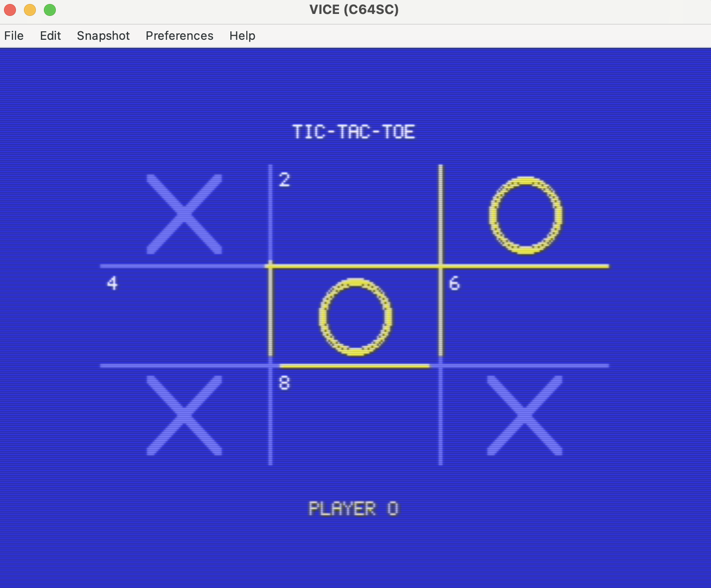

# C64 Tic-Tac-Toe

Two-player tic-tac-toe for the Commodore 64, written in C with [cc65](https://cc65.github.io/) and rendered directly to the VIC-II hi-res bitmap.



## Controls

Cells are numbered 1–9 in numpad layout:

```
 1 | 2 | 3
---+---+---
 4 | 5 | 6
---+---+---
 7 | 8 | 9
```

Players alternate (X then O). Press the digit for an empty cell to place your mark. After a win or draw, press any key to start a new game.

## Build & run

Requires `cl65` (cc65) and `x64sc` (VICE). The Makefile points at a local VICE install — adjust `EMU` if yours lives elsewhere.

```sh
make            # builds ttt.prg
make run        # launches it in x64sc
```

## Tests

`check_winner` and related board logic are exercised by a host-side unit test that compiles the same `ttt.c` with `-DUNIT_TEST`:

```sh
make test
```
